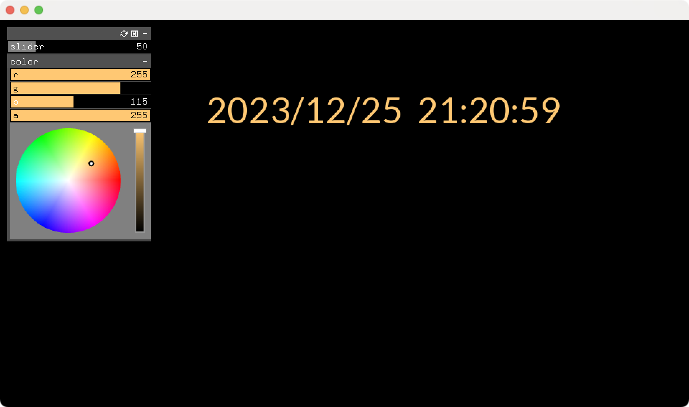
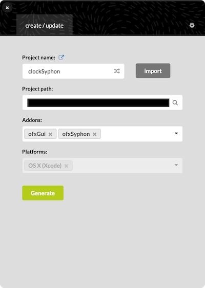
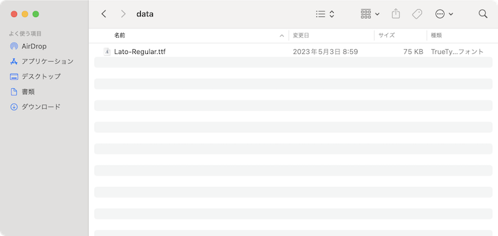

# clockSyphon
This App outputs time date by Syphon using openFrameworks, I made this for the VJ at the year-end countdown event. 

年末カウントダウンイベントのVJ用にopenframeworksでSyphon出力する時計を作った

## Feature

- syphon output available (https://syphon.github.io/)
- 1/1000 sec. can be displayed as an option
- Optionally display the day of the week

# Executable file
The executable file is in the "bin.zip". Unzip "bin.zip" to use.

手っ取り早く使いたい人へ、実行ファイル(アプリ)はbin.zipに入ってます。bin.zipを解凍して使用してください。

# Build

Generate a project by applying ofxGui and ofxSyphon with projectGenerator of openFrameworks.

openFrameworksのprojectGeneratorでofxGuiとofxSyphonを適用してプロジェクトを生成します。

the free font place under openFrameworks/apps/myApps/clockSyphon/bin/data

適当なフリーフォントをopenFrameworks/apps/myApps/clockSyphon/bin/data配下に置く

free font フリーフォント https://fonts.google.com/specimen/Lato
