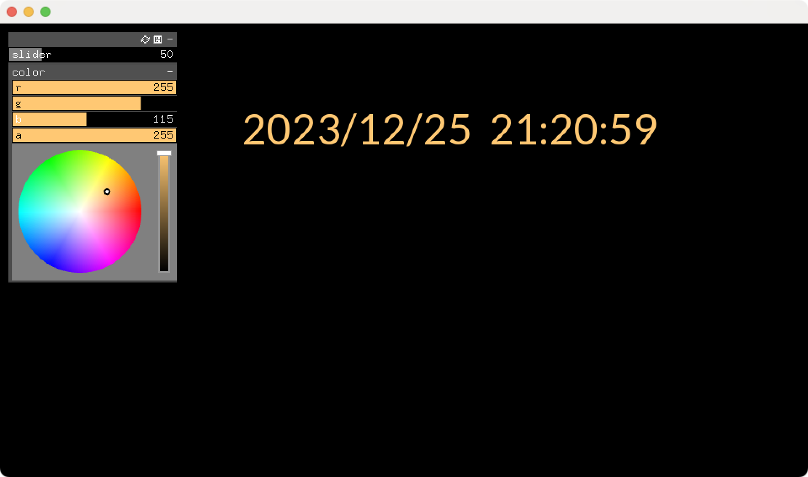

# clockSyphon
A clock that outputs Syphon using openFrameworks for the VJ at the year-end countdown event. 

年末カウントダウンイベントのVJ用にopenframeworksでSyphon出力する時計を作った

# Usage

Generate a project by applying ofxGui and ofxSyphon

ofxGuiとofxSyphonを適用してプロジェクトを生成する

the free font place under openFrameworks/apps/myApps/clockSyphon/bin/data

適当なフリーフォントopenFrameworks/apps/myApps/clockSyphon/bin/data配下に置く

https://fonts.google.com/specimen/Lato
